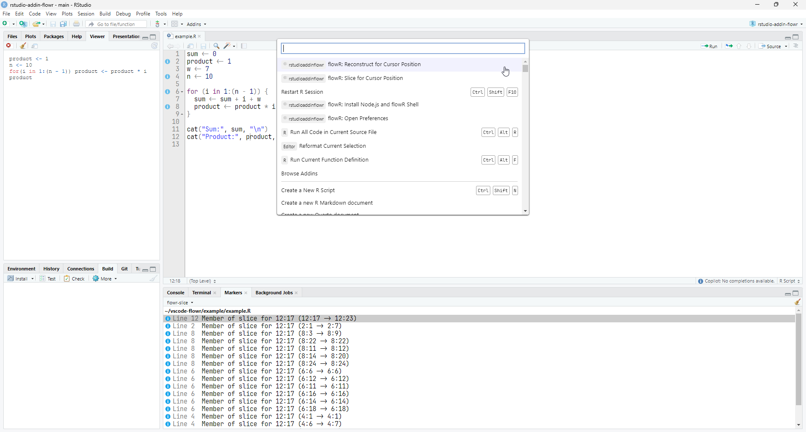

# rstudio-addin-flowr

RStudio addin for [*flowR*](https://github.com/Code-Inspect/flowr)



## Installing
This package is currently only available here on GitHub, but it can be installed easily using the devtools package by running the following commands:
```R
install.packages("devtools")
devtools::install_github("flowr-analysis/rstudio-addin-flowr")
```

In the future, we plan on making the package available on CRAN as well.

## Usage

After installing the package, you can start RStudio and run any of the addins provided by this package through the command palette (they all start with the name *flowR*), or through the Addins menu.

For more info on using addins, see [the RStudio User Guide](https://docs.posit.co/ide/user/ide/guide/productivity/add-ins.html).

### Preferences

This package contains a variety of preferences that can be set through the *flowR* preferences menu available through the "Open Preferences" addin. 

These preferences include whether to start a local *flowR* shell, what syntax highlighting themes to use for the reconstruction view, and more.

### Connecting to *flowR*

To connect to a *flowR* server, two connection modes are available, which can be chosen from in the preferences menu through the "Use local shell" checkbox: connecting to a remote *flowR* server, and starting up and connecting to a local *flowR* server.

To connect to a local *flowR* server, the "Install Node.js and flowR Shell" has to be run once after the package was installed. This causes a local installation of Node.js and *flowR* to be downloaded and stored in the package's installation directory.

The connection will automatically be initiated when the first addin that requires one is run.

### Slicing

You can generate a [slice](https://github.com/flowr-analysis/flowr/wiki/Terminology#program-slice) of the currently highlighted variable in any R code by using the "Slice for Cursor Position" addin. All code that is part of the generated slice will then be highlighted with a blue symbol in the gutter.

When using the "Reconstruct for Cursor Position" addin, the slice's reconstructed code is also shown in the viewer.

## Development

This addin requires the `flowr` package. It's recommended to clone [flowR-R-adapter](https://github.com/flowr-analysis/flowR-R-adapter) into the same parent directory as this addin, and then install a development version of it by running the following:

```R
devtools::install_local("../flowr-R-adapter", force = TRUE)
```

To install a development version of the addin for testing in RStudio, run

```R
devtools::install_local(".", force = TRUE); devtools::reload()
```

from the repository's root directory.
